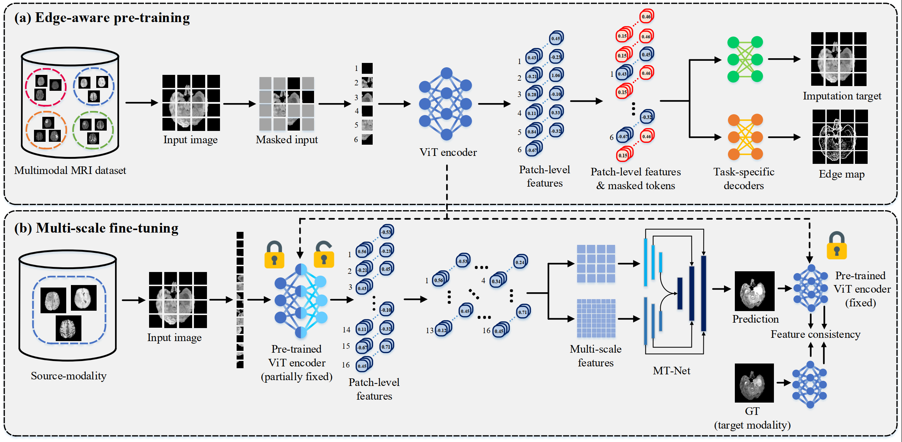

# Edge-MAE
We provide Pytorch implementations to pre-train Edge-MAE introduced in our paper [Multi-scale Transformer Network for Cross-Modality MR Image Synthesis](https://ieeexplore.ieee.org/document/10158035) (IEEE TMI).
  
## 1. Introduction

We propose Edge-MAE to leverage to take advantage of both paired and unpaired data for MRI synthesis. Nevertheless, our pre-trained Edge-MAE can be utilized for various downstream tasks, such as segmentation or classification.

<p align="center">
     <br />
    <em> 
    Figure 2. An overview of the proposed framework.
    </em>
</p>

## 2. Getting Started

- ### Installation

  Install PyTorch and torchvision from http://pytorch.org and other dependencies. You can install all the dependencies by
  ```bash
  pip install -r requirements.txt
  ```
  
- ### Dataset Preparation

  Download [BraTS2020](https://www.kaggle.com/datasets/awsaf49/brats20-dataset-training-validation?resource=download) dataset from kaggle. The file name should be `./data/archive.zip`. Unzip the file in `./data/`. 

- ### Date Preprocessing

  After preparing all the data, run the `./utils/preprocessing.py` to normalize the data to [0,1] and crop out an image of size 200×200 from the center.

- ### Pre-training

  - To pre-train our Edge-MAE with single GPU, run `single_gpu.py`. \
  - To pre-train our Edge-MAE multiple GPUs (with torch.nn.dataparallel), run `dp.py`.\
  - To pre-train our Edge-MAE multiple GPUs (with DistributedDataParallel), run `ddp.py`.\
  - To pre-train our Edge-MAE multiple GPUs (with Huggingface Accelerate), run `accelerate launch --config_file accelerate_config.json ac.py`.

## 3. Citation

```bibtex
@ARTICLE{10158035,
  author={Li, Yonghao and Zhou, Tao and He, Kelei and Zhou, Yi and Shen, Dinggang},
  journal={IEEE Transactions on Medical Imaging}, 
  title={Multi-scale Transformer Network with Edge-aware Pre-training for Cross-Modality MR Image Synthesis}, 
  year={2023},
  volume={},
  number={},
  pages={1-1},
  doi={10.1109/TMI.2023.3288001}}
```

## 4. References
- BraTs 2020: [[HERE]](https://www.med.upenn.edu/cbica/brats2020/data.html)

- MAE: [[HERE]](https://github.com/facebookresearch/mae)

